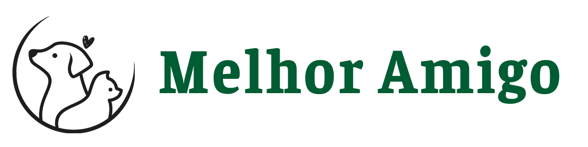
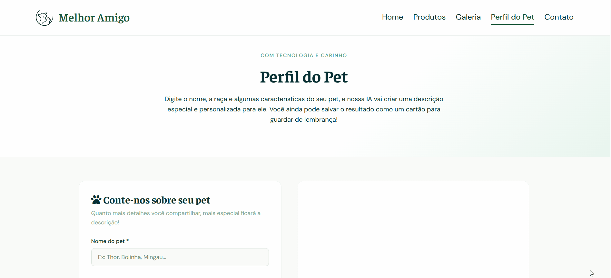

<div align="center">
  

  <p><strong>Hotsite institucional para petshop com gerador de perfil de pet via Inteligência Artificial.</strong></p>

  <p>
    
    
    
    
  </p>

</div>

<p>
  <a href="https://pbrunog7.github.io/petshop-melhor-amigo-website/">🌐 Ver projeto online</a>
</p>

---

## 📖 Sobre o Projeto

O **Petshop Melhor Amigo** é um hotsite institucional desenvolvido como projeto de portfólio.

O site conta com cinco páginas, design responsivo Mobile First e uma feature de Inteligência Artificial que gera descrições personalizadas para pets — integrada a uma API back-end em Flask que protege as credenciais e se comunica com o Google Gemini.

> 🔗 Repositório da API (back-end Flask): [petshop-melhor-amigo-api](https://github.com/pbrunog7/petshop-melhor-amigo-api)

---

## 🗂️ Páginas

| Página | Descrição |
|---|---|
| `index.html` | Página inicial com hero section, cards animados, seção de serviços e promoção |
| `produtos.html` | Catálogo com accordion animado e cards gerados dinamicamente via JS |
| `galeria.html` | Galeria com lightbox funcional, navegação por setas e suporte a swipe mobile |
| `contato.html` | Formulário com validação JS e envio real de e-mail via EmailJS |
| `perfildopet.html` | Gerador de perfil de pet com IA — integrado ao back-end Flask e Google Gemini |

---

## ✨ Funcionalidades

✅ **Header e footer dinâmicos** injetados via JavaScript (`main.js`), evitando repetição de código HTML

✅ **Menu mobile** com overlay, blur, animação de hamburguer → X e bloqueio de scroll do body

✅ **Accordion animado** com `max-height` e botão "Ver mais / Ver menos"

✅ **Cards de produtos** gerados dinamicamente a partir de array de objetos em JS

✅ **Lightbox** construído do zero com navegação por índice, boundary checks e swipe touch no mobile

✅ **Formulário de contato** com validação independente por campo e integração com EmailJS

✅ **Responsividade Mobile First** com media queries por arquivo de página

✅ **Gerador de perfil de pet com IA**
  - Formulário com validação (nome, gênero, raça e descrição livre)
  - Loading state animado durante o processamento
  - Card de resultado injetado dinamicamente via JS
  - Opção de salvar o perfil como PDF
  - Comunicação segura via API Flask — chave do Gemini protegida no servidor

<p align="left">
  
</p>

---

## 🛠️ Tecnologias Utilizadas

- **HTML5** semântico
- **CSS3** — Custom Properties, Flexbox, Grid, `clamp()`, animações e `@media print`
- **JavaScript ES6+** — sem frameworks
- **EmailJS** — envio de e-mails pelo formulário de contato
- **Google Gemini API** — geração de descrições personalizadas via IA (integrada via back-end Flask)

---

## 📁 Estrutura de Pastas

```
petshop-melhor-amigo/
├── index.html
├── produtos.html
├── galeria.html
├── contato.html
├── perfildopet.html
├── css/
│   ├── style.css              # Estilos globais, variáveis e componentes compartilhados
│   └── pages/
│       ├── home.css
│       ├── produtos.css
│       ├── galeria.css
│       ├── contato.css
│       └── perfildopet.css
├── js/
│   ├── main.js                # Header/footer dinâmicos e menu mobile — carregado em todas as páginas
│   ├── produtos.js            # Lógica do accordion e geração de cards
│   ├── galeria.js             # Lightbox, navegação e swipe touch
│   ├── contato.js             # Validação do formulário e integração com EmailJS
│   └── perfildopet.js         # Gerador de perfil de pet com IA
└── assets/
    ├── images/
    └── favicon.png
```

---

## ▶️ Como Executar Localmente

O front-end é estático — não requer instalações. Basta:

1. Clonar ou baixar o repositório
2. Abrir o arquivo `index.html` em qualquer navegador moderno

> ⚠️ A página **Perfil do Pet** depende da API back-end para funcionar. Consulte as instruções de execução no [repositório da API](https://github.com/pbrunog7/petshop-melhor-amigo-api).

> ⚠️ Para que o formulário de contato funcione, é necessário configurar suas próprias credenciais do EmailJS no arquivo `contato.js`.

---

## 📐 Padrões e Boas Práticas Aplicadas

- **BEM** para nomenclatura de classes CSS
- **Mobile First** com breakpoints progressivos
- **Separation of Concerns** — JS separado por responsabilidade de página
- **DRY** — funções centralizadas como `openLightbox(index)` e `toggleClasses()`
- **CSS Custom Properties** para consistência visual e fácil manutenção
- **Segurança** — chave de API protegida no back-end, nunca exposta no front-end

---

## 👨‍💻 Autor

**Paulo Gomes** — Desenvolvedor Full Stack  
📍 São Paulo, Brasil  
📧 pbrunog7@gmail.com  
🔗 [github.com/pbrunog7](https://github.com/pbrunog7)

---

## 📄 Licença

Este projeto foi desenvolvido para fins de portfólio.
